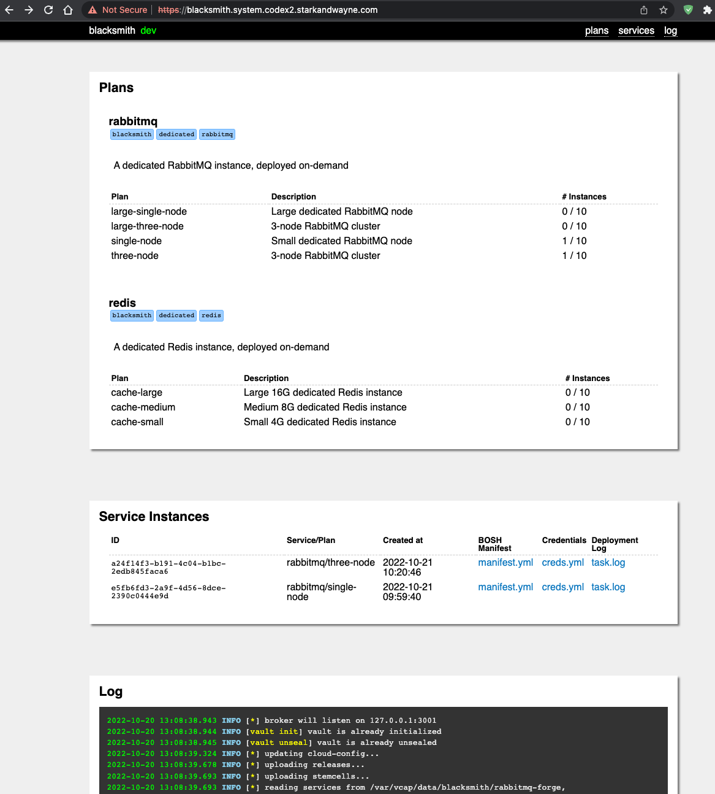

# Blacksmith Genesis Kit



The Blacksmith Genesis Kit gives you the ability to deploy on-demand services in Cloud Foundry, using the Open Service Broker API. These services will be backed by real VMs, running under the watchful eye of a dedicated BOSH director.

## What is Blacksmith?

Blacksmith is an on-demand service broker that uses BOSH to provision dedicated service instances for Cloud Foundry applications. When a user requests a service instance through the CF marketplace, Blacksmith:

1. Receives the request through the Open Service Broker API
2. Provisions a dedicated BOSH deployment for that service instance
3. Creates and manages credentials for the service
4. Makes the service available to applications

## Key Features

- **Multiple IaaS Support**: Deploy Blacksmith on vSphere, AWS, Azure, Google Cloud, OpenStack, or STACKIT
- **Comprehensive Service Support**: Deploy a variety of data services including:
  - PostgreSQL databases
  - RabbitMQ message brokers (with TLS, clustering, and autoscaling)
  - Valkey key-value stores (with persistence and TLS)
  - Redis key-value stores (deprecated — use Valkey for new service instances)
  - MariaDB databases
  - Kubernetes clusters
- **Security Features**: TLS support, credential management, and role-based access control
- **Integration Options**: CF route registration, SHIELD backups, and external BOSH directors
- **Management Interface**: Web UI for service instance monitoring and management

## Architecture Overview

Blacksmith provides:

- An Open Service Broker (OSB) API endpoint for Cloud Foundry integration
- An internal BOSH director (or connection to external BOSH) for VM orchestration
- Service plans that define VM sizes, networks, and configurations
- Service instance lifecycle management
- Credential generation and rotation

## Quick Start

To use it, you don't even need to clone this repository! Just run
the following (using Genesis v2):

```
# create a blacksmith-deployments repo using the latest version of the blacksmith kit
genesis init --kit blacksmith

# create a blacksmith-deployments repo using v1.0.0 of the blacksmith kit
genesis init --kit blacksmith/1.0.0

# create a my-blacksmith-configs repo using the latest version of the blacksmith kit
genesis init --kit blacksmith -d my-blacksmith-configs
```

Once created, refer to the deployment repo's README for information on creating
new environments.

## Available Addons

Blacksmith comes with several useful addons to simplify management:

- **visit** - Opens the Blacksmith Web Management Console in your browser (macOS only)
- **register** - Registers the Blacksmith Broker with a Cloud Foundry instance
- **bosh** - Sets up a local alias for the Blacksmith's internal BOSH director
- **boss** - Runs the boss CLI to interact with Blacksmith directly
- **curl** - Makes direct API calls to the Blacksmith Broker

Run `genesis do <env> list` to see all available commands.

## Supported Service Forges

Blacksmith provides "forges" that know how to deploy specific data services:

### PostgreSQL
- Standalone and clustered deployments
- Configurable VM sizes and disk allocations
- Automated backups (with SHIELD integration)

### RabbitMQ
- Single-node and clustered deployments
- TLS encryption for secure messaging
- Dashboard registration with Cloud Foundry routes
- Autoscaling based on queue depth
- See [rabbitmq-walkthrough.md](rabbitmq-walkthrough.md) for details

### Valkey
- Standalone and clustered deployments with optional persistence
- TLS encryption for secure communication
- Cache and data store configurations

### Redis (deprecated)
- Deprecated — use the Valkey forge for all new service instances
- Retained for existing service instances only
- Standalone and clustered deployments with optional persistence
- TLS encryption for secure communication

### MariaDB
- MySQL-compatible database deployments
- Configurable VM sizes and disk allocations

### Kubernetes
- Containerized application platform
- Dedicated clusters for application teams

## Learn More

For more in-depth documentation, check out the [manual](MANUAL.md).

## License

This Genesis Kit is released under the [MIT License](LICENSE).

## Links

- [Blacksmith Project Page on Github](https://github.com/cloudfoundry-community/blacksmith)
- [Blacksmith BOSH Release Docs](https://github.com/cloudfoundry-community/blacksmith-boshrelease)
- [Open Service Broker API](https://www.openservicebrokerapi.org/)
- [Cloud Foundry](https://www.cloudfoundry.org/)
- [BOSH](https://bosh.io/)